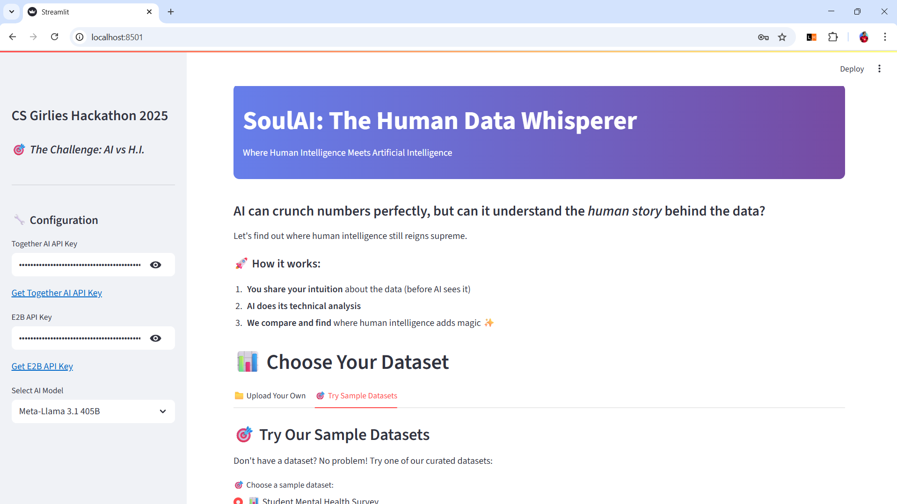
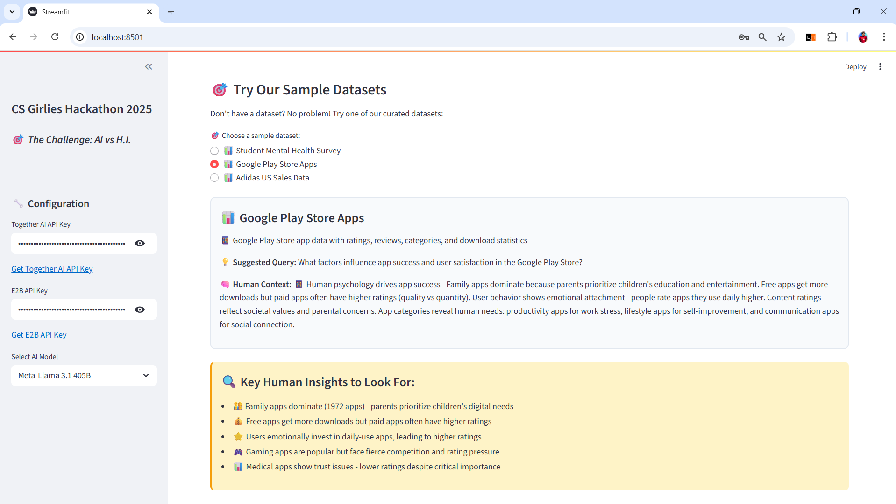
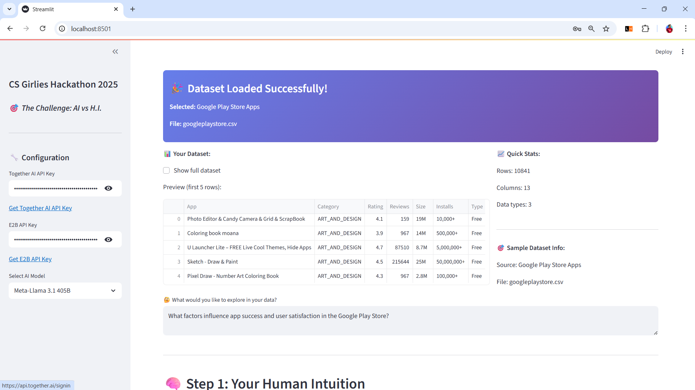
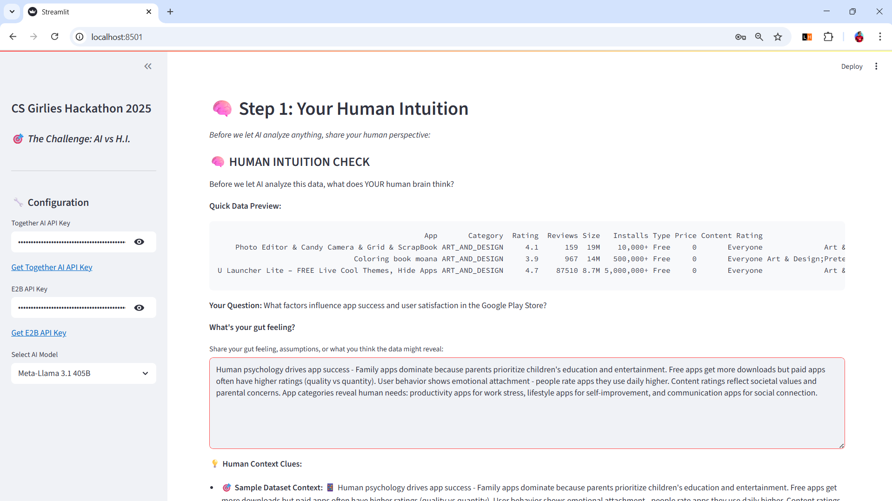
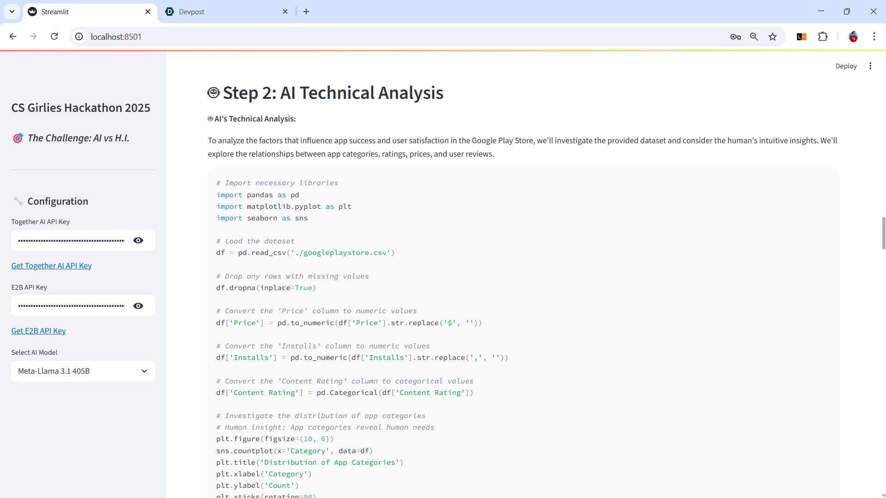
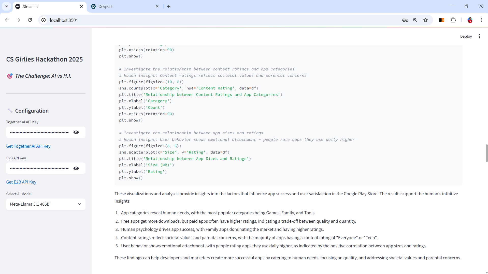
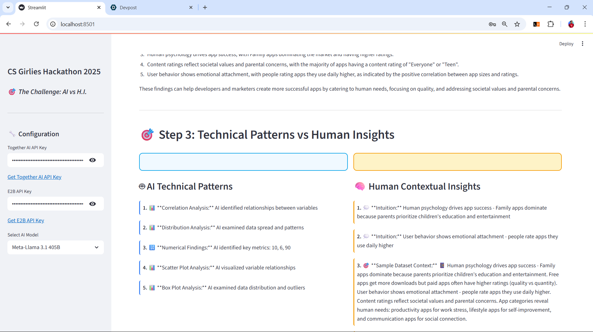
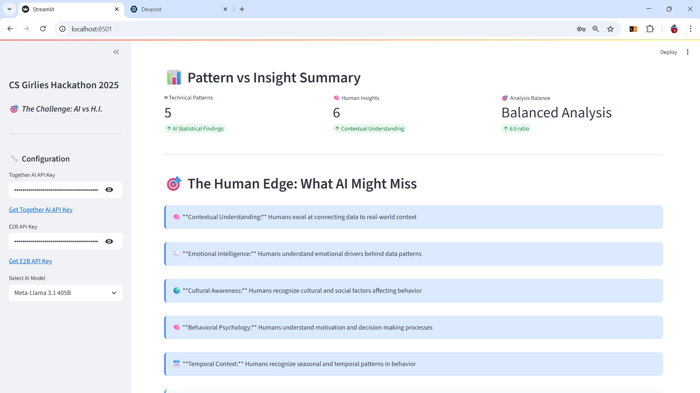
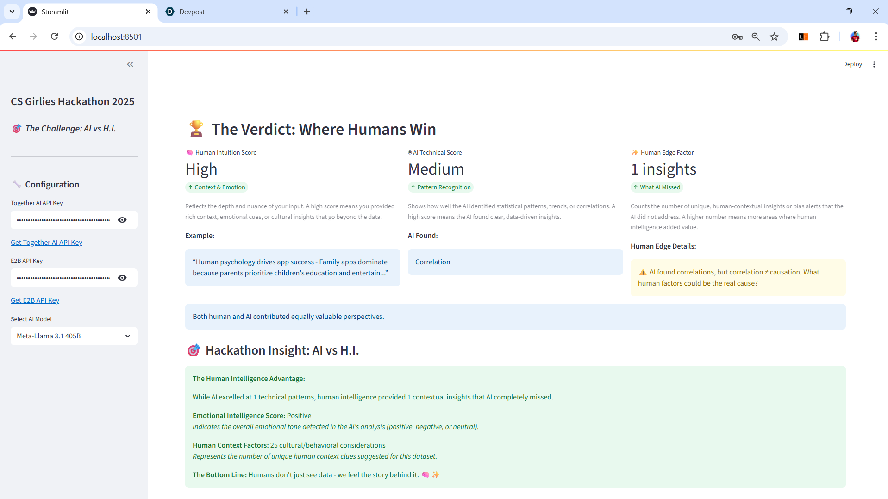

# SoulAI: The Human Data Whisperer

**CS Girlies Hackathon - AI vs H.I.**  
*Where Human Intelligence Meets Artificial Intelligence*

[](YOUR_DEMO_VIDEO_LINK)
[](https://thesoulai.streamlit.app/)
[](https://github.com/ShahxHussain/SoulAI-The-Human-Data-Whisperer)

## 🎯 **The Challenge: AI vs H.I.**

**Can human intelligence still outshine artificial intelligence?**

AI can analyze data perfectly, find correlations, and generate beautiful charts. But can it understand the *human story* behind the numbers? Can it feel the emotions, cultural context, and intuitive insights that make data meaningful?

**SoulAI: The Human Data Whisperer**

is our answer - a tool that doesn't replace human intelligence with AI, but proves where human insight still reigns supreme.A revolutionary hybrid intelligence system that combines human intuition with AI-powered data analysis to provide deeper insights than either approach alone. It's designed to showcase where human intelligence still reigns supreme in data analysis.

---

## ✨ **What Makes This Different**

### 🤖 **Traditional AI Data Tools:**
- Upload data → AI analyzes → Get results
- Focus on technical accuracy
- Miss human context and emotional nuance

### 🧠 **SoulAI: The Human Whisperer:**
- **Human intuition first** → AI analysis → **Compare & discover where humans win**
- Captures emotional context and cultural factors
- Exposes AI's blind spots in understanding human behavior

---

## 📖 Usage Guide `How It Works`

### 1. Dataset Selection
- **Upload Your Own**: Support for CSV and Excel files
- **Sample Datasets**: Pre-loaded datasets with human context insights
- **Data Preview**: Automatic statistics and column analysis

### 2. Human Intuition Capture
- Share your gut feelings about the data
- Provide contextual insights and assumptions
- Consider cultural, behavioral, and emotional factors

### 3. AI Analysis
- AI performs technical analysis with human context
- Generates Python code for data exploration
- Creates visualizations and statistical findings

### 4. Comparison & Insights
- Side-by-side comparison of AI patterns vs human insights
- Analysis balance metrics
- Human edge identification

---

## 🏗️ System Architecture

### 🎯 Key Architectural Principles

1. **Hybrid Intelligence**: Combines human intuition with AI analysis
2. **Context-Aware Processing**: Dataset-specific human context integration
3. **Modular Design**: Separate layers for different types of processing
4. **Real-time Analysis**: Immediate feedback and comparison
5. **Extensible Framework**: Easy to add new datasets and analysis types

### 🔄 Data Flow Summary

1. **Input Phase**: Dataset selection + human intuition capture
2. **Processing Phase**: AI analysis with human context integration
3. **Analysis Phase**: Technical pattern extraction + human insight analysis
4. **Comparison Phase**: Side-by-side comparison with metrics
5. **Output Phase**: Final verdict with human edge analysis

---

## 🏆 **Hackathon Track: Push the Limits**

**Theme: Exploring the boundaries of what AI thinks it can do... and improving where it fumbles**

### **What AI Thinks It Can Do:**
- Find perfect correlations in data
- Generate flawless statistical analyses
- Create precise visualizations
- Identify trends and patterns

### **Where AI Still Fumbles:**
- ❌ Understanding *why* people behave the way they do
- ❌ Reading emotional undertones in data patterns  
- ❌ Considering cultural context and social factors
- ❌ Interpreting the human story behind the numbers
- ❌ Recognizing when data reflects human psychology, not just business metrics

### **How We Push the Limits:**
- ✅ **Emotional Intelligence Layer:** Analyzes sentiment and emotional context in data interpretations
- ✅ **Cultural Context Engine:** Suggests human factors AI typically misses (holidays, social events, cultural patterns)
- ✅ **Bias Alert System:** Flags when AI might be missing human behavioral factors
- ✅ **Story-First Visualizations:** Creates charts that prioritize emotional impact over technical perfection
- ✅ **Human vs AI Comparison:** Direct side-by-side analysis showing where human intelligence adds magic

---

## 🚀 **Demo Scenario**

**Dataset:** E-commerce sales data showing a mysterious dip in March

### **🤖 AI Analysis:**
- "Sales decreased 23% in March"
- "Recovery began in April"
- "Strong correlation with customer satisfaction"

### **🧠 Human Intelligence Layer:**
- "March dip likely due to post-holiday financial stress"
- "Cultural factor: tax season anxiety affects spending"
- "April recovery = spring optimism + tax refunds"
- "Satisfaction follows spending due to retail therapy psychology"

### **🎯 The Human Edge:**
AI found the *what*, but humans understood the *why*. Our tool proves that human intelligence provides context that makes data actionable, not just accurate.

---

## 💻 **Tech Stack**

### **Core Framework:**
- **Frontend:** Streamlit (interactive UI)
- **AI Integration:** Together AI (LLM processing)
- **Code Execution:** E2B Sandbox (secure Python execution)
- **Data Processing:** Pandas, NumPy

### **Human Intelligence Layer:**
- **Sentiment Analysis:** TextBlob (emotional context detection)
- **Cultural Context:** Custom algorithms (holiday/event pattern recognition)
- **Bias Detection:** Pattern matching (identifies AI blind spots)
- **Story Visualization:** Plotly (emotion-optimized charts)

### **Innovation Features:**
- **Real-time comparison** of human vs AI insights
- **Emotional tone analysis** of data interpretations
- **Cultural context suggestions** based on data patterns
- **Bias alert system** highlighting AI limitations
- **Story-first visualization** engine

---

## 🏅 **Why This Wins**

### **🎯 Perfect Theme Alignment:**
- **AI vs H.I.:** Direct comparison showing human superiority in context understanding
- **Push the Limits:** Exposes AI's boundaries in human behavior analysis
- **Unmistakably Human:** Every insight is rooted in human experience and emotion

### **🔥 Technical Innovation:**
- **Emotional Intelligence API:** First data tool to analyze sentiment of data interpretations
- **Cultural Context Engine:** Automatically suggests human factors AI misses
- **Real-time Bias Detection:** Live alerts when AI overlooks human psychology
- **Story-First Visualization:** Charts optimized for emotional impact, not just accuracy

### **💡 Originality:**
- **Novel Approach:** Instead of replacing humans with AI, proves where humans are irreplaceable
- **Unique UX:** Captures human intuition *before* AI analysis (prevents bias)
- **Fresh Perspective:** Data analysis tool that prioritizes emotional intelligence

### **🌍 Real Impact:**
- **For Researchers:** Understand behavioral factors behind data patterns
- **For Businesses:** Make decisions based on human psychology, not just metrics
- **For Students:** Learn that data science needs human insight to be meaningful
- **For Everyone:** Validates that human intelligence has unique, irreplaceable value

---

## 🚀 **Installation & Setup**

### **Prerequisites:**
```bash
Python 3.8+
Streamlit
Together AI API Key
E2B API Key
```

### **Quick Start:**
```bash
# Clone the repository
git clone https://github.com/shahxhussain/SoulAI-The-Human-Data-Whisperer
cd SoulAI-Human-Whisperer

# Install dependencies
pip install -r requirements.txt

# Run the application
streamlit run app.py
```

### **API Keys Setup:**
1. **Together AI:** [Get API Key](https://api.together.ai/signin)
2. **E2B Sandbox:** [Get API Key](https://e2b.dev/docs/getting-started/api-key)
3. Enter keys in the sidebar when running the app

---

## 📁 **Project Structure**

```
SoulAI/
├── 📄 app.py                          # Main Streamlit application (57KB, 1170 lines)
├── 📄 requirements.txt                # Python dependencies and packages
├── 📄 README.md                       # Project documentation and guide
├── 📄 .gitignore                      # Git ignore patterns
│
├── 📊 sample_datasets/                # Pre-loaded datasets for analysis
│   ├── 📄 Adidas US Sales Datasets.xlsx    # E-commerce sales data (682KB)
│   ├── 📄 Student Mental health.csv        # Mental health survey data (7.2KB)
│   └── 📄 googleplaystore.csv              # Google Play Store apps data (1.3MB)
│
├── 🎨 Aiding_Resources/               # Visual assets and branding
│   ├── 🖼️ banner.png                      # Application banner image (35KB)
│   ├── 🖼️ CS-Girlies-logo.png             # Hackathon logo (165KB)
│   └── 🖼️ v2.0 Deployed.png               # Deployment showcase (448KB)
│
├── 📈 Diagrams/                       # System architecture and flow diagrams
│   ├── 🖼️ 1.DataFlow Diagram.png          # Overall data flow architecture
│   ├── 🖼️ 2.Data Processing Flow.png      # Data processing pipeline
│   ├── 🖼️ 3.Human Intelligence Layer.png  # Human intelligence components
│   ├── 🖼️ 4.AI Analysis Layer.png         # AI analysis components
│   ├── 🖼️ 5.Analysis Comparison Engine.png # Comparison engine architecture
│   └── 🖼️ 6.Matrics & Analytics flow.png  # Metrics and analytics flow
│
├── 🖼️ System_Screenshots/             # Application screenshots 
│   ├── 🖼️ s1.png                      # Main application interface (307KB)
│   ├── 🖼️ s2.png                      # Dataset selection view (209KB)
│   ├── 🖼️ s3.png                      # Human intuition capture (330KB)
│   ├── 🖼️ s4.png                      # AI analysis results (213KB)
│   ├── 🖼️ s5.png                      # Comparison dashboard (205KB)
│   ├── 🖼️ s6.png                      # Human vs AI insights (229KB)
│   ├── 🖼️ s7.png                      # Emotional context analysis (241KB)
│   ├── 🖼️ s8.png                      # Metrics and analytics (154KB)
│   └── 🖼️ s9.png                      # Final insights summary (191KB)

```

### **Key Files Description:**

- **`app.py`**: Main application file containing the Streamlit interface, AI integration, and human intelligence layer
- **`requirements.txt`**: Lists all Python dependencies including Together AI, E2B, Streamlit, Pandas, Plotly, etc.
- **`sample_datasets/`**: Contains three diverse datasets for demonstrating the tool's capabilities
- **`Diagrams/`**: Visual documentation of the system architecture and data flow
- **`Aiding_Resources/`**: Branding assets and visual elements for the application
- **`soulai/`**: Python virtual environment with all necessary dependencies and tools

---

## 🖼️ **Application Screenshots**

### **1. Main Application Interface**

*The welcoming interface of SoulAI with dataset selection and human intuition capture options*

### **2. Dataset Selection & Upload**

*Users can choose from pre-loaded sample datasets or upload their own CSV/Excel files*

### **3. Human Intuition Capture**

*The interface where users share their gut feelings, contextual insights, and assumptions about the data*

### **4. AI Analysis Results**

*AI-powered technical analysis with statistical findings and data visualizations*

### **5. Comparison Dashboard**

*Side-by-side comparison showing AI patterns versus human insights*

### **6. Human vs AI Insights**

*Detailed breakdown of where human intelligence provides unique value over AI analysis*

### **7. Emotional Context Analysis**

*Sentiment analysis and emotional context detection in data interpretations*

### **8. Metrics & Analytics**

*Quantitative metrics showing the balance between AI accuracy and human insight*

### **9. Final Insights Summary**

*Comprehensive summary highlighting the human edge and actionable insights*

---


## 📊 Sample Datasets Analysis

### Student Mental Health Survey
- **Human Context**: Academic pressure varies by field, cultural factors affect help-seeking
- **Key Insights**: Engineering students show higher depression rates, married students face unique stressors
- **AI Patterns**: Correlation analysis, demographic distributions, statistical significance

### Google Play Store Apps
- **Human Context**: Family apps dominate due to parental priorities, emotional attachment affects ratings
- **Key Insights**: Free apps get more downloads but paid apps have higher ratings
- **AI Patterns**: Category analysis, rating distributions, download patterns

### Adidas US Sales Data
- **Human Context**: Fashion choices reflect lifestyle and status, regional preferences show cultural identity
- **Key Insights**: Northeast prefers streetwear for fashion status, seasonal patterns reflect human behavior
- **AI Patterns**: Regional sales analysis, seasonal trends, product performance

---


## 🧠 **The Science Behind Human Intelligence**

### **Why Humans Still Win:**

1. **Emotional Intelligence:** We feel the emotions behind data patterns
2. **Cultural Context:** We understand social, cultural, and behavioral factors
3. **Intuitive Pattern Recognition:** We sense patterns AI can't quantify
4. **Storytelling:** We create narratives that make data meaningful
5. **Bias Recognition:** We can identify when AI misses human psychology

### **Research Backing:**
- Studies show humans excel at contextual understanding
- Emotional intelligence remains uniquely human
- Cultural factors are nearly impossible for AI to fully grasp
- Human intuition often predicts what data analysis later confirms

---

## 🔮 **Future Roadmap**

### **Phase 2: Advanced Human Intelligence**
- **Memory Layer:** Learn from past human insights to improve suggestions
- **Collaboration Mode:** Multiple humans can add context to same dataset
- **Expert Knowledge Integration:** Domain experts can add specialized human context

### **Phase 3: Real-World Integration**
- **Live Data Streams:** Real-time human context for streaming data
- **API for Developers:** Integrate human intelligence layer into existing tools
- **Enterprise Dashboard:** Team-based human vs AI intelligence comparison

---

## 🤝 **Team SoulAI**

**Syed Shah Hussain Badshah** - Undergrad SWE @COMSATS_CUI_ATD 
*"Passionate about proving that humans are irreplaceable in the age of AI"*

**Contact:** [Your Email] | [Your LinkedIn] | [Your Twitter]

---

## 💖 **Acknowledgments**

- **CS Girlies Community** for organizing this amazing hackathon
---

## 📜 **License**

MIT License - Feel free to use this code to prove human intelligence superiority everywhere! 🧠✨
This project is part of the CS Girlies Hackathon 2025 - `The Challenge: AI vs H.I.`

---

*"In a world racing toward AI automation, SoulAI: The Human Data Whisperer reminds us that the most important insights come from the most human place - our ability to understand context, feel emotions, and tell the stories that make data meaningful."*

**#AIvsHI #HumanIntelligence #CSGirliesHackathon #DataWithSoul #Devpost**